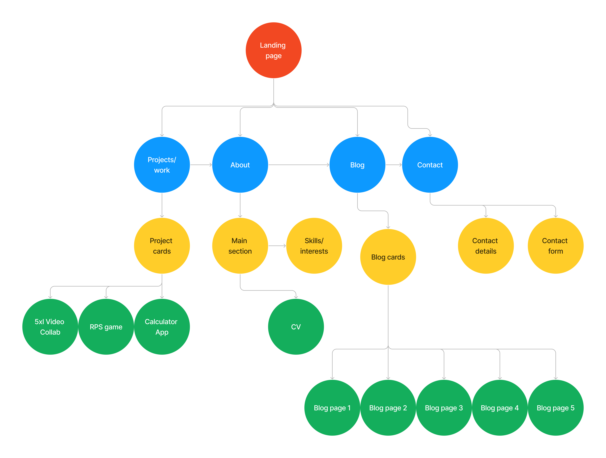

# General Documentation of project WIP

## Liam Massey  

***

### Purpose

The purpose of my web developer portfolio is to design and implement a website portfolio that not only advertises myself and my brand to potential employers but also shows a strong message of my morals and who I am as a person.  
  (Can I pad this out?)

#### Target Audience

***

### Tech Stack

- HTML
- SCSS/CSS
- Wireframes - Figma
- Gimp -Image resizing/modelling
- Github - repo
- Netlify - live website deployment

***

### Functionality/Features

***

### Sitemap

***

### Screenshots

### html  

Using html semantics to ensure readability and accessibility for screen readers
